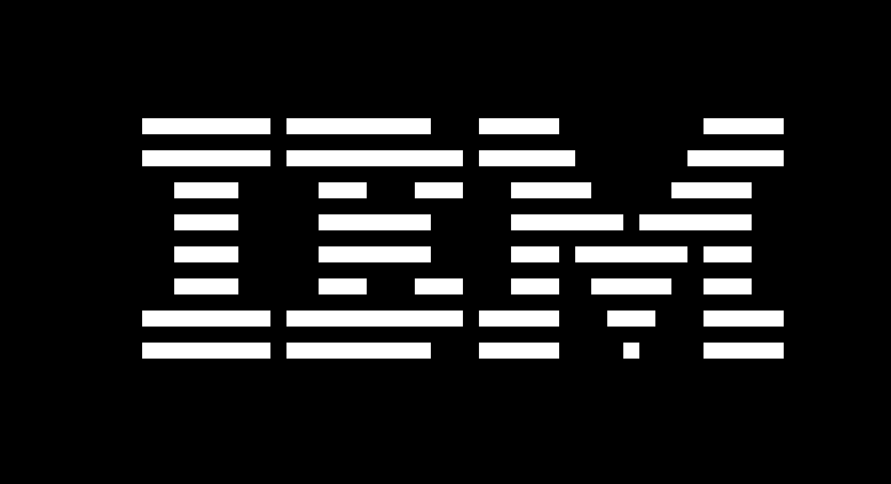
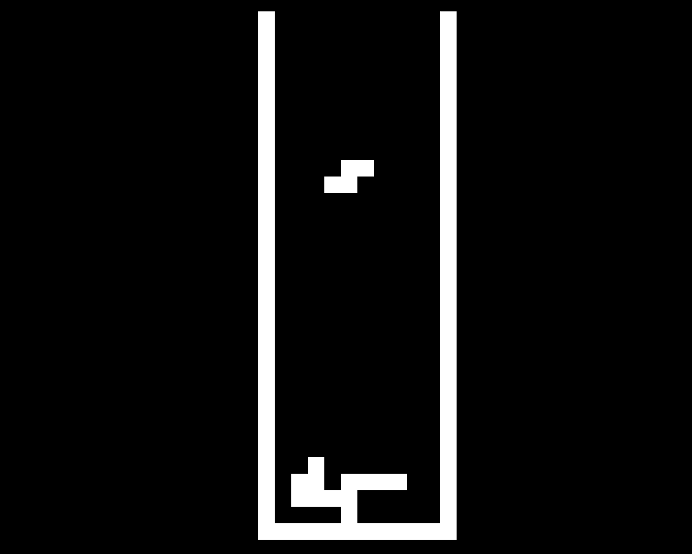

# CHIP-8 Emulator

A CHIP-8 Emulator written in C++ with the help of SDL3.

Built mostly as a learning project to explore emulation, SDL and timing systems.

## Features

- CHIP-8 interpreter (as expected)
- SDL3 renderer
- keyboard input
- fixed timing system (CPU 500 Hz, Rendering 60 Hz)
- audio
- pause/reload/turning off audio support (as of now)

## Controls

| CHIP-8 | Keyboard |
|--------|----------|
| `1` `2` `3` `C` | `1` `2` `3` `4` |
| `4` `5` `6` `D` | `Q` `W` `E` `R` |
| `7` `8` `9` `E` | `A` `S` `D` `F` |
| `A` `0` `B` `F` | `Z` `X` `C` `V` |

Additionally:
- `F1` - Reloads ROM & CHIP-8
- `F2` - Pause emulator (Note: In games that render movement a lot for example pong during a "blink" this may cause some sprites to be not rendered)
- `F3` - Disable/Re-enable audio

## Building

### Requirements

- C++20 compiler
- CMake
- SDL3

### Build

```bash
mkdir build
cd build
cmake ..
make
```

## How to run

```bash
./app <path-to-rom>
```

## Screenshots

### Pong


### IBM Test ROM


### Tetris


## License

MIT License
